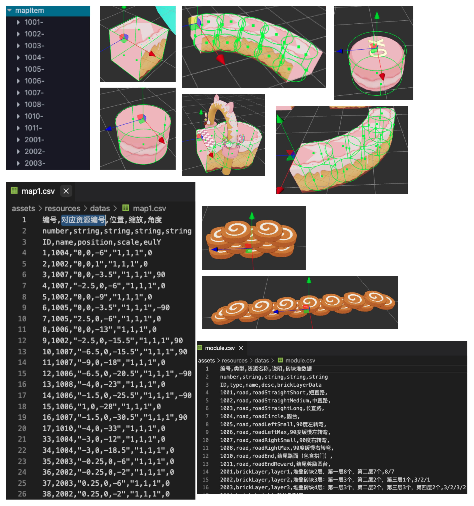
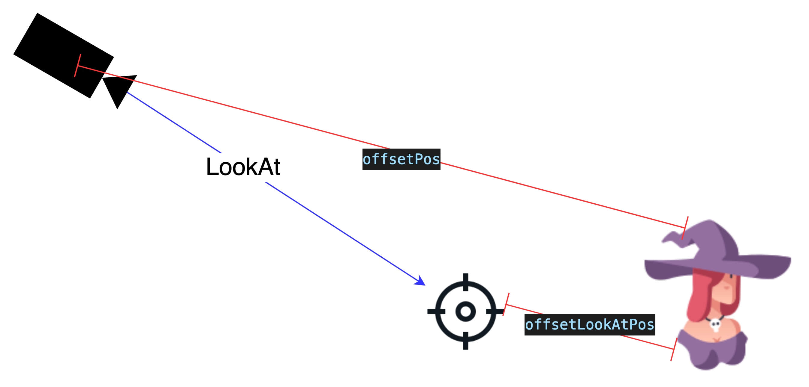
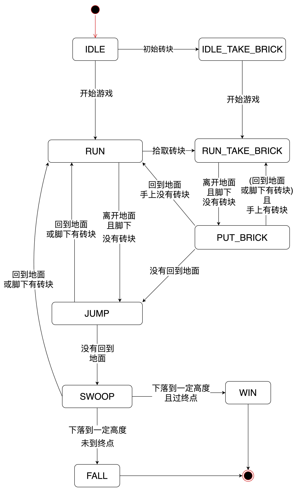
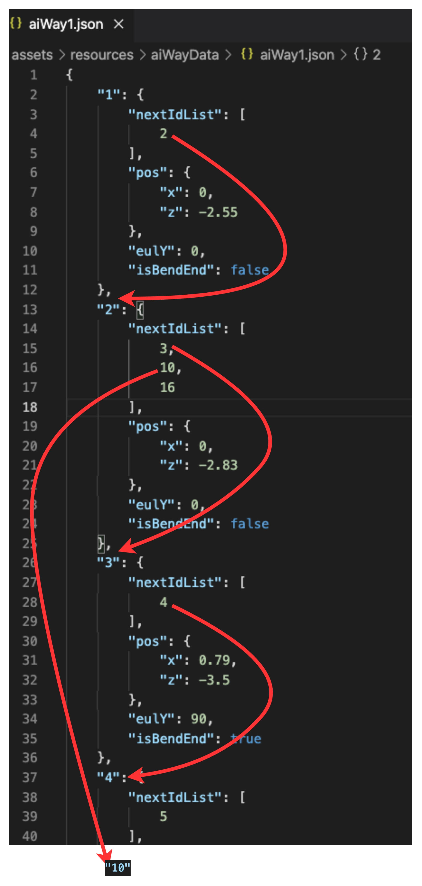
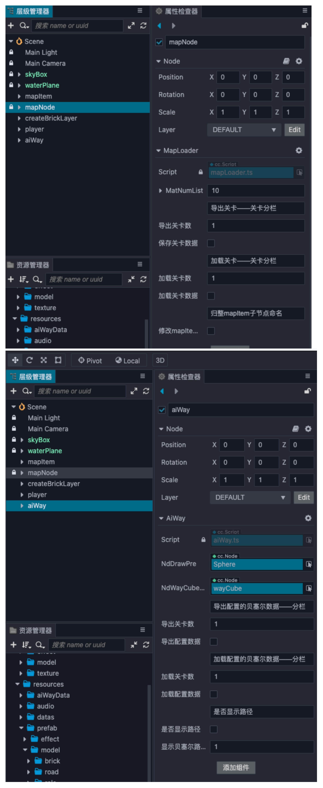

# 项目简要介绍

App Store曾经将.io游戏列为 “值得关注的四个趋势”之一， io 类玩法以操作规则简单、多人在线对抗、死后即刻复活等为特点。曾经的《球球大作战》、《贪吃蛇大作战》风靡一时的游戏类型，并且近年一直在不断的进化和扩展当中。

于是官方推出了“奔跑吧小仙女”。此款游戏中角色会自动前进，玩家需要滑动屏幕控制角色移动的方向，游戏中可通过收集木板来跨域水域达到抄近路的目的。 一共 5 人参与，通过过终点的终点线，判断名次，第一个到达终点即为胜利。

之前推出的“奔跑吧巨人”是使用物理，用物理淌了不少坑，这些坑的解决办法。“奔跑吧小仙女”跟巨人上有个很明显的区别，在不使用物理的基础上，如何进行开发。
同时，我们也配置了完整的教程，包括如何启动场景，摄像机跟随，水面和天空球的设置，玩家与AI的控制，以及如何加载数据，相关配置文件。除此之外我们还有地图编辑器，供玩家扩展使用。

(插入试玩视频/小程序等)

# 关键技术点解析

对于本项目，主要讲解其中几个点
- 游戏场景与地图生成
- 玩家控制与AI
- 地图编辑器
- 性能优化

## 游戏场景与地图生成

“奔跑的小仙女们”设定在一个水上乐园，为这美丽的环境，我们给场景中添加了天空球和水面效果。  

我们只需要简单的图片和简单的模型就能实现好看的效果！

天空球由以下组成
- 球模型
- 一张贴图
- 一个旋转动画
- 一个 `builtin-unlit` 无光照材质

   

水面由以下几部分构成
- 平面模型(四方形)
- 噪声贴图(用于显示水纹)
- 深度贴图(控制水的颜色，中心到边缘的变化)
- 一小段shader代码

  

游戏中除了漂亮的环境，还有可爱的地图。

地图的设计时采用地图块的方式，先预设几个地图块，接着根据配置表中的地图块的位置缩放等信息，生成完整地图。  

  

```ts
// 根据配置表信息布置地图块
ndItem.position = gameUtils.setStringToVec3(itemData.position);
ndItem.scale = gameUtils.setStringToVec3(itemData.scale);
ndItem.eulerAngles = new Vec3(0, Number(itemData.eulY), 0);
```


## 玩家控制与AI
### 摄像机跟随与缓动

小仙女的跑动怎么能少了摄影师？为了能更好的拍摄小仙女的运动，这里设计了跟随相机。  

只需小小的 `lookAt` 加上平缓的插值预算，相机跟随如你所愿！ 

     

来！直接进入核心代码讲解！ 

```ts
/**
 * 移动摄像机位置/角度 每帧运行
 * @param lerpPosNum 坐标修改的lerp参数
 * @param lerpEulNum 角度修改的lerp参数
 */
private followTarget(lerpPosNum: number, lerpEulNum: number ) {
    // 目标节点的位置
    const targetPos = this.ndTarget.getPosition();
    // 目标节点在y轴的旋转
    const eulerY = this.ndTarget.eulerAngles.y;
    const _quat = Quat.fromEuler(new Quat(), 0, eulerY, 0);
    // 相对目标节点的位置y旋转矩阵，用于偏移向量转到该坐标系
    const _mat4 = Mat4.fromRT(new Mat4(), _quat, targetPos);
    // 相机位置偏移向量
    v3_pos.set(this.offsetPos);
    // 求出在目标节点坐标系的偏移向量
    v3_pos.transformMat4(_mat4);
    // 求一个插值
    v3_selfPos.lerp(v3_pos, lerpPosNum);
    // 设置相机的位置
    this.node.position = v3_selfPos;

    // 求出lookAt的目标点坐标
    v3_pos.set(targetPos.add(this.offsetLookAtPos));
    // 求一个插值
    v3_look.lerp(v3_pos, lerpEulNum);
    // 设置相机 lookAt
    this.node.lookAt(v3_look);
}
```

### 代码控制角色移与动触发器的结合

小仙女目前是在一个水平面奔跑的，所以小仙女的移动位置可以根据速度和角色朝向去控制。  

```ts
// 下落移动
this._nowSpeedY += gameConstants.ROLE_GRAVITY_JUMP * dt;
pos.y += this._nowSpeedY * dt;

// 前进移动
let speed = dt * this._speed;
const eulYAngle = eul.y * macro.RAD;
const addX = speed * Math.sin(eulYAngle);
const addZ = speed * Math.cos(eulYAngle);
pos = pos.subtract3f(addX, 0, addZ); //角色前进方向为当前朝向的反向
this.node.setPosition(pos);
```

因为有些路块的形状比较特殊，我们为小仙女和路块添加了碰撞触发器。可以通过设置分组与掩码来控制触发器的触发。  
[https://docs.cocos.com/creator/3.0/manual/zh/physics/physics-group-mask.html](https://docs.cocos.com/creator/3.0/manual/zh/physics/physics-group-mask.html)

```ts
//只要以下条件为真就会进行检测
//(GroupA & MaskB) && (GroupB & MaskA)
//碰撞分组/掩码
COLLIDER_GROUP_LIST: { 
    DEFAULT: 1 << 0,
    PLAYER: 1 << 1,
    FLOOR: 1 << 2,
    AI: 1 << 3,
},
// 设置地板的 分组，掩码
let colliderList = ndItem.getComponents(Collider)!;
for (let j = 0; j < colliderList.length; j++) {
    colliderList[j].setGroup(gameConstants.COLLIDER_GROUP_LIST.FLOOR);
    colliderList[j].setMask(gameUtils.getAiAndPlayerGroup());
}
// 设置角色分组，掩码
const rbAi = this.node.addComponent(RigidBody);
rbAi.setGroup(gameConstants.COLLIDER_GROUP_LIST.AI);
rbAi.setMask(gameConstants.COLLIDER_GROUP_LIST.FLOOR);
```

小仙女是否到达终点和脚下的路面的信息都是根据触发器的事件去记录。 

```ts
// 触发器事件
collider.on('onTriggerEnter', this._triggerEnter, this);
collider.on('onTriggerExit', this._triggerExit, this);

_triggerEnter(event: ITriggerEvent) {
   if (ndOther.name === gameConstants.CSV_MAP_ITEM_NAME.FINISH_LINE) {
        // 到达终点
        return;
    }
    //角色与地面接触，加入列表
    this._onFloorList.push(ndOther);
}

_triggerExit(event: ITriggerEvent) {
    if (!event.otherCollider) return;
    let ndOther = event.otherCollider.node;
    let findIndex = this._onFloorList.indexOf(ndOther);
    if (findIndex !== -1) {
        //角色离开地面，移除列表
        this._onFloorList.splice(findIndex, 1);
    }
}
```

当然，小仙女的主要逻辑采用的是状态机的模式去控制和设计。  

     

小仙女的动作是根据状态模式去判断。

```ts
set roleState(state: number) {
    this._roleState = state;
    // 播放对应的动作
    this._aniRole.play(gameConstants.ROLE_STATE_NAME[this._roleState]);
}
```

### AI

AI小仙女大部分逻辑与玩家控制的小仙女的逻辑相通，与之不同的是，AI是读取配置，生成一条路径。  

  

移动时，根据速度计算两个路径点间的插值，算出最终位置。  

```ts
//通过贝塞尔路径点xz轴移动
this._bezierNowId += dt * this._speed;
let bezierNowId = Math.floor(this._bezierNowId);

if (bezierNowId >= this._bezierList.length - 1) {
    this._isOver = true;
    // 到达终点
    return;
}

if (bezierNowId !== this._bezierlastId) {
    // 处理朝向
    this._bezierlastId = bezierNowId;
    const sub = this._bezierList[bezierNowId].clone().subtract(this._bezierList[bezierNowId + 1]);
    this._nextEul.set(0, Math.atan2(sub.x, sub.y) * macro.DEG, 0)
}

// 插值
const subIndex = this._bezierNowId - bezierNowId;
this.node.setRotationFromEuler(this._nextEul);
const nextPos = this._bezierList[bezierNowId].clone().lerp(this._bezierList[bezierNowId + 1], subIndex)
this.node.setPosition(nextPos.x, pos.y, nextPos.y);

this._checkSpeed(dt);
```

## 地图编辑器

上面提到了地图配置，ai路径配置，这些并不是凭空去配置的。

为此在`Cocos Creator`编辑器中，专门添加了一个`map.scene`场景，为策划提供可视化的配置。  

  

策划只需要在指定节点编辑地图块(或AI位置)，点击导出按钮即可。 

程序根据节点的信息，生成对应的配置数据。  

```ts
//当前项目文件路径
const projectPath = window.cce.project as string; 
projectPath.replace("\\", " / ");

const filePath = `${projectPath}/` + MAP_PATH;
// 一键引入文件操作
const fs = require('fs');
//关卡数据处理
let data = MAP_DATA_FIRST + '';
for (let i = 0; i < this.node.children.length; i++) {
    let ndItem = this.node.children[i];
    //坐标/大小/旋转均以最多两位小数存储
    const pos = this._getNumberToFixed2(ndItem.getPosition());
    const scale = this._getNumberToFixed2(ndItem.getScale());
    const eulY = ndItem.eulerAngles.y;//this._getNumberToFixed2(ndItem.eulerAngles.clone());
    //生成sting型数据  数据之间以,隔开 在最后加上换行\n
    let itemData = `${i + 1},${ndName},${pos},${scale},${eulY}` + '\n';
    data += itemData;
}
// 写文件
fs.writeFile(filePath + MAP_PREFIX + this.mapNameSave + '.csv', data, (err: Error) => {
    //...
});

// 读文件
const path = `${projectPath}/` + MAP_PATH + MAP_PREFIX + this.mapNameLoad + '.csv';
fs.readFile(path, 'utf-8', (err: Error, data: any) => {
    //...
})
```


## 性能优化

### 碰撞体使用

对于还不需要使用的碰撞体，并且会与多个分组发生碰撞，产生计算的模型。可先暂时关闭模型上的的碰撞体，根据距离判断模型是否需要开启碰撞体。亦或是，节省不必要的碰撞体，使用距离计算，适用于场景中的道具类型物品。

当前项目中：
- 铺设在路面上可拾取的砖块就使用距离计算的方式，并且对砖块进行了区块划分。
- 铺设在地面上的可行走的砖块也使用距离计算的方式，判断当前脚下是否有砖块。  
  

分以下几步处理
1. 计算当前z对应的砖块所在区间（例：当前将所有砖块根据**z轴**的**距离1**进行划分）
```ts
public static checkNowBrickIndex(posZ: number) {
   	//对当前坐标z值进行对gameConstants.BRICK_CAN_GET_INTERVAL取余并四舍五入取整
   	return Math.abs(Math.floor(posZ / gameConstants.BRICK_CAN_GET_INTERVAL));
}
```
2. 将当前砖块的坐标z按照距离划分后放入数组中
```ts
let nowRow = gameUtils.checkNowBrickIndex(pos.z);
if (!GameManager.canGetBrickList[nowRow]) {
//判断是否不存在 不存在则需要声明为数组
GameManager.canGetBrickList[nowRow] = [];
}
GameManager.canGetBrickList[nowRow].push(ndNowBrick);
```
3. 角色根据当前坐标与地面砖块进行判断是否拾取
```ts
const pos = this.node.getPosition();
let index = gameUtils.checkNowBrickIndex(pos.z)
let nowBrickList = GameManager.canGetBrickList[index];
if (!nowBrickList) return;
for (let i = nowBrickList.length - 1; i > -1; i--) {
//进一步判断当前砖块与主角的距离是否拾取
}
```

### 分帧执行

将不需要每帧刷新的代码，间隔一定帧数执行。

```ts
update(){
    const num = 3;  //间隔num帧执行一次方法
    //director.getTotalFrames() 获取 director 启动以来游戏运行的总帧数
	if (director.getTotalFrames() % num === 0) {
     	//执行相应操作
     }    
}
```


# 下载与安装

- 项目链接：[https://store.cocos.com/app/detail/3126](https://store.cocos.com/app/detail/3126)
- 下载与安装指引：[https://store.cocos.com/document/zh/](https://store.cocos.com/document/zh/)